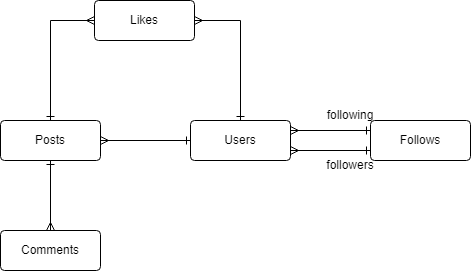
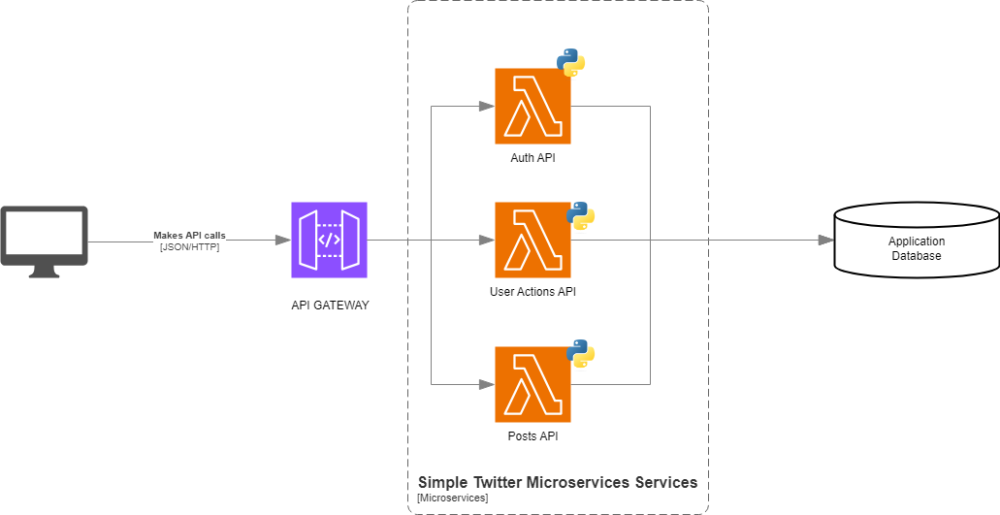

# Simple-Twitter-on-microservices

Para este ejercicio desplegaremos un API con microservicios para simular el comportamiento básico de una app cómo Twitter.

## Diseño

### Conceptos

Primero identificamos los conceptos básicos para que la app funcione y cómo se relacionan estos.

<p align="center">
  
</p>

Después de definir los conceptos ahora podemos definir que acciones se deberían poder realizar en el aplicativo.

### Métodos y recursos

**Posts (publicaciones)**

- *GET* /feed-> Obtener publicaciones para el feed del usuario

- *POST* /posts -> Crear publicaciones

- *GET* /posts/{id} -> Obtener publicación

- *PUT* /posts/{id} -> Editar una publicación existente

- *DELETE* /posts/{id} -> Eliminar publicación

**Comments (Comentarios)**

- *POST* /posts/{id}/comments -> Agregar comentario a una publicación

- *GET* /posts/{id}/comments -> Obtener comentarios de publicación

**Likes**

- *POST* /posts/{id}/like-> Darle Me gusta a una la publicación

- *DELETE* /posts/{id}/like -> Quitar el Me gusta de una publicación


**Users (Usuarios)**

- *POST* /users/{id}/follow -> Seguir a usuario

- *POST* /users/{id}/unfollow -> Dejar de seguir a usuario

- *GET* /users/{id}/followers -> Obtener seguidores

- *GET* /users/{id}/following -> Obtener seguidos

- *GET* /users/{id}/posts-> Obtener publicaciones del usuario

También necesitamos que un usuario pueda iniciar sesión y registrarse


**Auth (Autenticación)**

- *POST* /register -> Registrar usuarios

- *POST* /login -> Iniciar sesión


### Arquitectura

Estas funciones de la aplicación estarán repartidas en 3 microservicios.




Como usaremos API Gateway le asignáremos un prefijo a cada microservicio.

**Microservicios:**

**Auth API**

  - **Prefijo:** auth-api/v1
  - **Recursos:** Auth

**Posts API**

  - **Prefijo:** posts-api/v1
  - **Recursos:** Comments, Posts, Likes


**Users API**

  - **Prefijo:** users-api/v1
  - **Recursos:** Users

## Virtual environment

### Install

https://virtualenv.pypa.io/en/latest/installation.html

```
# In some linux systems
sudo apt install python3-virtualenv
```

### Use

```
# Create environment with python3.10
virtualenv -p python3.10 env

# Access environmet
source ./env/bin/activate

# Exit environment
deactivate
```

## Install Requirements

    pip install -r requirements

```
# In some linux systems
sudo apt install uvicorn
```


## Run Services

```
cd src/services/<service-name>

uvicorn app.main:app --reload

# Run service in other port
uvicorn app.main:app --reload --port 8001

```
