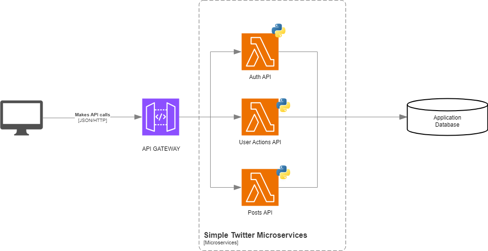
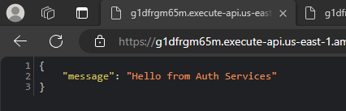

# Simple-Twitter-on-microservices

Para este ejercicio desplegaremos un API con microservicios para simular el comportamiento básico de una app cómo Twitter. Usaremos las tecnologías AWS API Gateway, AWS Lambda Functions y el framework de python FastApi para la implementación.

## Diseño

### Conceptos

Primero identificamos los conceptos básicos para que la app funcione y cómo se relacionan estos.

<p align="center">
  
</p>

Después de definir los conceptos ahora podemos definir que acciones se deberían poder realizar en el aplicativo.

### Métodos y recursos

**Posts (publicaciones)**

- *GET* /feed-> Obtener publicaciones para el feed del usuario

- *POST* /posts -> Crear publicaciones

- *GET* /posts/{id} -> Obtener publicación

- *PUT* /posts/{id} -> Editar una publicación existente

- *DELETE* /posts/{id} -> Eliminar publicación

**Comments (Comentarios)**

- *POST* /posts/{id}/comments -> Agregar comentario a una publicación

- *GET* /posts/{id}/comments -> Obtener comentarios de publicación

**Likes**

- *POST* /posts/{id}/likes-> Darle Me gusta a una la publicación

- *DELETE* /posts/{id}/likes -> Quitar el Me gusta de una publicación


**Users (Usuarios)**

- *POST* /users/{id}/follow -> Seguir a usuario

- *POST* /users/{id}/unfollow -> Dejar de seguir a usuario

- *GET* /users/{id}/followers -> Obtener seguidores

- *GET* /users/{id}/following -> Obtener seguidos

- *GET* /users/{id}/posts-> Obtener publicaciones del usuario

También necesitamos que un usuario pueda iniciar sesión y registrarse


**Auth (Autenticación)**

- *POST* /register -> Registrar usuarios

- *POST* /login -> Iniciar sesión


### Arquitectura

Estas funciones de la aplicación estarán repartidas en 3 microservicios.




Como usaremos API Gateway le asignáremos un prefijo a cada microservicio.

**Microservicios:**

**Auth API**

  - **Prefijo:** auth-api/v1
  - **Recursos:** Auth

**Posts API**

  - **Prefijo:** posts-api/v1
  - **Recursos:** Comments, Posts, Likes


**Users API**

  - **Prefijo:** users-api/v1
  - **Recursos:** Users

## Implementación
Para la implementación se realizarán los 3 microservicios usando el framework de python [FastApi](https://fastapi.tiangolo.com/es/).

También se usara la herramienta de python virtualenv para generar los paquetes que serán subidos a las lambdas al momento del despliegue.

### Virtual environment

**Instalación**

[Guía de instalación](https://virtualenv.pypa.io/en/latest/installation.html)

```Bash
# En algunos sistemas linux se instala así para ejecutarlo como comando de terminal
sudo apt install python3-virtualenv
```

**Usando el ambiente virtual**

```Bash
# Crear un ambiente dentro de la carpeta del proyecto con python3.10
virtualenv -p python3.10 env

# Acceder al ambiente
source ./env/bin/activate

# Verificar la versión de python
python --version

# Salir del ambiente virtual
deactivate
```

### Instalar los paquetes necesarios para ejecutar la aplicación

**Instalando usando un archivo con una lista de paquetes**

```Bash
pip install -r requirements.txt
```

**Instalando directamente los paquetes**

```Bash
pip install fastapi
pip install "uvicorn[standard]"
pip install mangum
```

[uvicorn](https://www.uvicorn.org) es una implementación de servidor web ASGI para Python.

[mangum](https://pypi.org/project/mangum/) es un adaptador que se encarga de tomar los eventos que vengan de API Gateway y los envía a los recursos del servicio.


```Bash
pip install mangum
```


```Bash
# En algunos sistemas linux se instala así para ejecutarlo como comando de terminal
sudo apt install uvicorn
```


## Ejecutando algún servicio

```Bash
# Accedemos a la carpeta del servicio
cd src/services/<service-name>

# Corremos el API usando uvicorn
uvicorn app.main:app --reload

# Ejecutando el servicio en un puerto diferente
uvicorn app.main:app --reload --port 8001
```

## Desplegando a AWS lambdas

### Creando archivos zip con lo necesario para ejecutar el los servicios.
NOTA: Nos aseguramos de que estemos ejecutando el ambiente virtual y de que hayamos instalado los paquetes dentro de este.

Puede revisar que paquetes hay instalados con el comando:
```Bash
pip list
```

```Bash
# Vamos a la carpeta de paquetes de python
cd env/lib/python3.10/site-packages/

# Generamos 3 zip con los archivos y los mandamos a la raíz del proyecto
zip -r9 ../../../../auth-services.zip .
zip -r9 ../../../../posts-services.zip .
zip -r9 ../../../../user-services.zip .

# Regresamos a la raiz del proyecto
cd ../../../../

# Por cada microservicio accedemos a la carpeta y agregamos los archivos al zip correspondiente

cd src/services/auth-services
zip -g ../../../auth-services.zip -r app

cd ../../services/posts-services
zip -g ../../../posts-services.zip -r app

cd ../../services/user-services
zip -g ../../../user-services.zip -r app

# Regresamos a la raiz del proyecto
cd ../../../

```


### Cargando los zip a AWS

1. Creamos un bucket en S3
  

2. Cargamos los archivos zip que generamos.
  

### Creando las lambdas

1. Creamos 3 funciones lambda de la siguiente manera:
  

2. En la sección de código de la lambda le damos click a cargar desde S3.
  

3. Nos apareceta el siguiente campo para colocar la url de un archivo, para obtener la url vamos al respectivo zip que cargamos en el bucket, copiamos la url, la pegamos en el campo y le damos guardar.
  
  

4. Ahora que subimos el código de la lambda tenemos cambiar el controlador, para hacerlo en la pestaña de código vamos a la sección de *Configuración del tiempo de ejecución* y le dámos click en editar.
  

5. Cambiamos el dato del controlador por el siguiente y guardamos.
  

- **Probando la función**

  Si queremos hacer una prueba de la lambda podemos ir a la sección de probar, crear un nuevo evento y creamos el evento con las siguientes características:
  

  Si todo sale bien al ejecutar la prueba debería salirle lo siguiente:
  


## Creando API con AWS API Gateway
1. Vamos a API Gateway y creamos una nueva API de REST
  

2. Creamos los 3 recursos de API con los prefijos que planteamos en el diseño (El prefijo del versionamiento se hizo dentro de los servicios con FastApi)
  

3. Ahora crearemos un método para cada endpoint, el método debe ser de tipo ANY, en tipo de integración escogemos función lambda, activamos la integración de proxy y escogemos la lambda correspondiente.
  

4. Después creamos un nuevo recurso de proxy para cada uno de los recursos principales.
  

5. Ahora en el método ANY que se genero para cada recurso proxy agregamos la integración lambda con la lambda correspondiente.
  

6. Ahora tenemos los siguientes recursos

    

7. Damos click al botón de implementar API y en el formulario que se despliega escogemos nueva etapa, la llamamos dev y damos click en implementación.

    

## Probando el API con algunos endpoints

  
  
  
  
  
  
  
  
